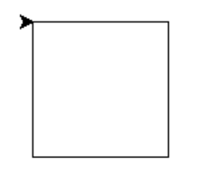
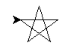
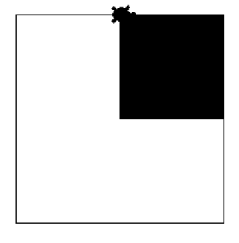
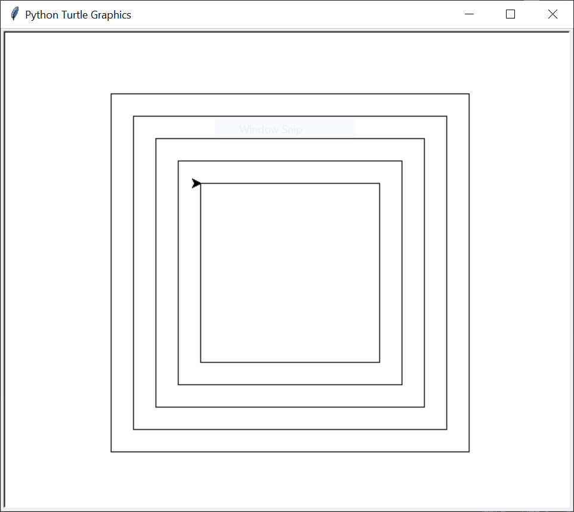

# Practical Scripting with Python
## UNO Summer Techademy

## Objectives:
- Demonstrate Turtle Graphics
- Create algorithms with Turtle

### Turtle Graphics
Drawing with a "turtle" is a popular way to visualize algorthms. It was part of the original Logo programming language developed in the 1960s by Wally Feruzig and Seymour Papert. Originally, a turtle was a robot that used a marker to make lines on a sheet of paper.

Go to Repl.it and pick **+ new repl**
Select **Python (with Turtle)**

This will be a little different because we won't have access to multiple files. Everything will happen in our main.py file.

```
import turtle
bob = turtle.Turtle() #bob is a Turtle
bob.forward(100)
```

### Turtle Methods
What can you do with a turtle? Any of these methods work:

| METHOD |PARAMETER |	DESCRIPTION |
| --- | --- | --- |
|Turtle()	| None | Creates and returns a new tutrle object|
|forward() |	amount | Moves the turtle forward by the specified amount|
|backward() | amount | Moves the turtle backward by the specified amount|
|right() |	angle |	Turns the turtle clockwise|
|left() |	angle |	Turns the turtle counter clockwise|
|penup() |	None |	Picks up the turtle’s Pen|
|pendown() |	None |	Puts down the turtle’s Pen|
|up() |	None |	Picks up the turtle’s Pen|
|down() |	None |	Puts down the turtle’s Pen|
|color() |	Color name |	Changes the color of the turtle’s pen|
|fillcolor() |	Color name |	Changes the color of the turtle will use to fill a polygon|
|heading() |	None |	Returns the current heading|
|position() |	None |	Returns the current position|
|goto()	| x, y |	Move the turtle to position x,y|
|begin_fill() |	None |	Remember the starting point for a filled polygon|
|end_fill() |	None |	Close the polygon and fill with the current fill color|
|dot() |	None |	Leave the dot at the current position|
|stamp() |	None |	Leaves an impression of a turtle shape at the current location|
|shape() |	shapename |	Should be ‘arrow’, ‘classic’, ‘turtle’ or ‘circle’|

### Algorithms with Turtles
How can we use these commands to make shapes?  
An **Algorithm** is a process or set of rules to be followed in calculations or other problem-solving operations, especially by a computer.

```
bob = turtle.Turtle()
count = 1
while count <= 4
  bob.forward(100)
  bob.right(90)
  count = count + 1
```


How could we make the following shape:  


### Functions
In python, we can define a functions. This can be useful in removing code that is repeated in multiple places in your program and placing it in a function. Functions can be used multiple times throughout your code.

```
def drawSquare(myTurtle):
  count = 1
  while count <= 4:
    myTurtle.forward(100)
    myTurtle.right(90)
    count = count + 1
```
Notice in this function that the ***myTurtle*** is in the parenthesis. This is an argument, you will have to put the name of your turtle in the parenthesis when you call this function.
```
bob = turtle.Turtle()
drawSquare(bob)
```

Finally, we can add parameters to make the drawSquare function more general. In this case, we will add a second parameter for the **size** of the sides.
```
def drawSquare(myTurtle, size):
  count = 1
  while count <= 4:
    myTurtle.forward(size)
    myTurtle.right(90)
    count = count + 1
```
---
## What else can you make?

### drawPolygon(turtle, sides)
Will draw a polygon given the number of sides.

### fillCorner(turtle, corner)
Draws a square with one of the corners filled in. Imagine that your square is divided with a horizontal and verticle line. Fill in one of the quadrants based on the input that the function is given.
1 - Top left
2 - Top right
3 - Bottom left
4 - Bottom right



### squaresInSquares(turtle, num)
Draws multiple squares within the previous squares. The given number will be how many squares should be on the screen.


